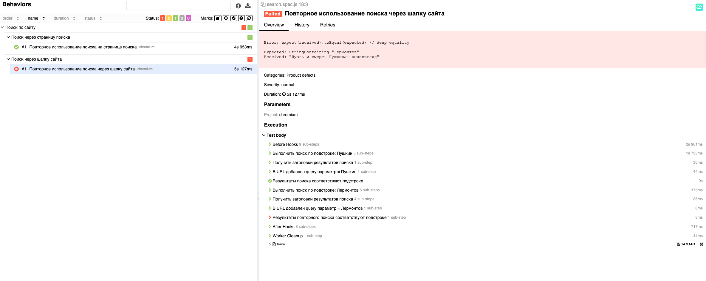

# QaGuruJS - Typical Test Task
QA guru js course - Homework after Lesson 10
- Создать новый репозиторий в git
- Написать автотест на тесткейс "Повторное использование поиска"

Предусловие:

Открыть сайт https://www.tretyakovgallery.ru/

Шаги:
- Нажать иконку поиска в верхней панели
- Ввести значение, например, Пушкин
- Проверить результаты выдачи (обратите внимание на адресную строку)
- Нажать иконку поиска в верхней панели
- Ввести значение, например, Италия
- Проверить результаты выдачи

Требования к тесту:
- Page Object
- подключен allure, каждая страница обернута шагами
- скриншот allure выложен в гитхаб в readme

Можно:
- добавить тестов для положительных и негативных сценариев
- попробовать выделить верхнее меню в отдельный компонент и подключить к главной странице и странице поиска
- написать тесты для проверки стиля компонентов поиска

